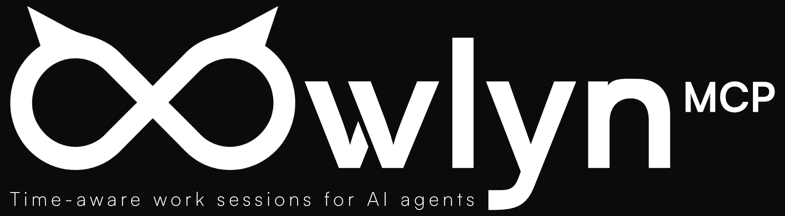

<p align="center">
  
</p>

# Owlyn MCP

Owlyn MCP is a local-first MCP work-session supervisor for AI coding agents that need deadlines, checkpoints and structured continuation decisions instead of a simple timer.

<p align="center">
  <a href="https://github.com/btitkin/OwlynMCP/actions/workflows/ci.yml"></a>
  <a href="https://github.com/btitkin/OwlynMCP/releases"></a>
  <a href="./LICENSE"></a>
  
</p>

It is for developers using agentic coding tools who want long-running work sessions to remain explicit, inspectable and bounded by safety rules.

AI agents often stop too early. You ask an agent to work until 06:00, it finishes the first task in 20 minutes, then says "done." Owlyn exists to make the continuation decision explicit.

## Preview

Screenshots / GIF demo coming soon.

The repository includes the Owlyn logo above and example session documentation in [docs/EXAMPLE_SESSION.md](./docs/EXAMPLE_SESSION.md).

## Features

- Stdio MCP server built with the official MCP SDK.
- Local SQLite session storage through `better-sqlite3`.
- Work-session lifecycle tools: start, status, checkpoint, should-continue, plan-next, end, list-sessions and report.
- Deadline and timezone handling for time-aware work sessions.
- Conservative continuation policy that stops for high-risk, destructive or approval-requiring work.
- Host setup and agent instruction docs for integrating Owlyn into coding-agent workflows.
- MCP smoke test that exercises the core tool flow.

## Installation

Requirements:

- Node.js 20+
- npm

```bash
git clone https://github.com/btitkin/OwlynMCP.git
cd OwlynMCP
npm install
npm run build
```

Installation instructions are based on the current repository structure and should be verified for each MCP host.

## Quick Start

Run the stdio MCP server:

```bash
node dist/index.js
```

Generic MCP server config:

```json
{
  "mcpServers": {
    "owlyn": {
      "command": "node",
      "args": ["/absolute/path/to/OwlynMCP/dist/index.js"],
      "env": {
        "OWLYN_DB_PATH": "/absolute/path/to/.owlyn/owlyn.sqlite"
      }
    }
  }
}
```

More host setup notes are in [docs/HOST_SETUP.md](./docs/HOST_SETUP.md).

## Examples / Use Cases

- Start a bounded AI-agent work session with a goal and deadline.
- Save checkpoints that include completed work, next tasks, validation and blockers.
- Ask whether the agent should continue after the current task finishes.
- Rank safe next tasks when time remains in a session.
- Produce a session report before ending work.

## Roadmap

See [docs/ROADMAP.md](./docs/ROADMAP.md) for the release path from alpha to v1.0.

Future ideas after v1.0 include optional JSON/Markdown export, optional session templates, host-specific config helpers, per-project session profiles, and optional pause/resume controls.

These items are not implemented in the current alpha release.

## Status

Alpha: the repository identifies version `v0.1.0-alpha.1`, includes tests, documentation and a manual MCP smoke test, and has been validated in Codex MCP host on Windows. Broader host compatibility should still be treated as pending unless verified in the target host.

## Host Validation Status

Validated:

- Codex MCP host on Windows

Pending:

- Cursor
- Claude Desktop
- other MCP stdio hosts

See [real host validation](./docs/REAL_HOST_VALIDATION.md), [host setup](./docs/HOST_SETUP.md), and the shared [validation prompt](./docs/VALIDATION_PROMPT.md).

## More Docs

- [FAQ](./docs/FAQ.md)
- [Host setup](./docs/HOST_SETUP.md)
- [Real host validation](./docs/REAL_HOST_VALIDATION.md)
- [Validation prompt](./docs/VALIDATION_PROMPT.md)
- [npm publishing preparation](./docs/NPM_PUBLISHING.md)
- [Roadmap](./docs/ROADMAP.md)
- [Tool reference](./docs/TOOLS.md)
- [Agent instructions](./docs/AGENT_INSTRUCTIONS.md)
- [Social post draft](./docs/SOCIAL_POST.md)

## Development

```bash
npm install
npm run typecheck
npm run build
npm test
npm run smoke:mcp
npm run check
```

Release checklist: [RELEASE_CHECKLIST.md](./RELEASE_CHECKLIST.md).

## License

MIT. See [LICENSE](./LICENSE).
